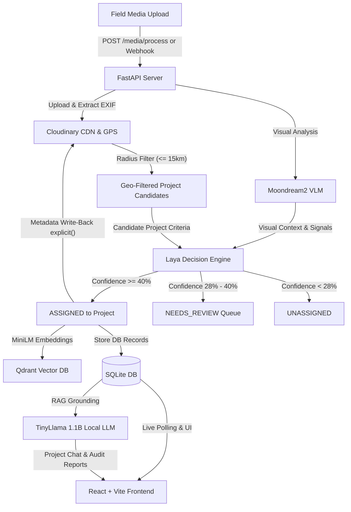

# 🪐 MIRA — Multimodal Intelligent Retrieval & Analysis

> **AI-Powered Field Media Intelligence, Semantic Routing & Cloudinary Transformation Platform**  
> *Built for Code Cubicle 6.0 — PS02 & Cloudinary Track*

---

## 🚀 Overview

Field teams across sustainability, infrastructure, and renewable energy capture hundreds of photos and videos daily. Manually reviewing, tagging, organizing, and linking media to projects is slow, error-prone, and unscalable.

**MIRA** transforms Cloudinary from a standard media bucket into an **active Media Intelligence Backbone**, automating the entire field asset lifecycle with zero cloud-compute overhead:

1. **Field Ingestion & Webhooks**: Ingest raw field captures directly via authenticated signed upload presets or event-driven Cloudinary webhooks with automatic EXIF GPS extraction.
2. **Geographic Radius Candidate Filter**: Uses Haversine distance calculations to narrow down candidate projects within radius (default 15 km) before routing decisions.
3. **Visual Intelligence (Moondream2 VLM)**: Extracts natural language descriptions, site activities, scenes, detected machinery, and domain signals locally.
4. **Automated Project Routing (Laya Engine)**: Non-autoregressive System 1 decision engine categorizes media into geographically-filtered projects in a single forward pass (~33ms) with zero hallucination.
5. **Cloudinary Intelligence Write-Back (`explicit()`)**: Synchronizes AI descriptions, activity tags, GPS data, and verification statuses directly into Cloudinary asset `context` and `tags`.
6. **Dual-Engine Hybrid Search**: Merges **Cloudinary Search API** Boolean tag/expression filters with **Qdrant Vector DB** semantic similarity.
7. **Visual Progression & Before/After Slider**: Dynamic side-by-side progression slider with SSIM visual variation scores and pure Cloudinary composite URLs.
8. **Dynamic Verified Provenance Badging**: Bakes verified status, project attribution, and GPS metadata into delivery URLs with zero backend image rendering.
9. **Project Intelligence Assistant (Local LLM RAG)**: Powered by a local GPU-accelerated LLM (`TinyLlama-1.1B`), delivering evidence-grounded Q&A, milestone timelines, and structured audit reports.

---

## 🛠️ Architecture & Pipeline



---

## 🧠 AI / ML Stack (100% Local Inference & Offline Capable)

| Component | Model / Engine | Purpose | Speed / Footprint |
| :--- | :--- | :--- | :--- |
| **Visual Analysis** | `vikhyatk/moondream2` | Extracts descriptions, activities, scenes, objects, and signals | 1.86B VLM (~1.5GB) |
| **Decision Routing** | `convaiinnovations/laya` | Non-autoregressive System 1 classifier against dynamic project criteria | 421M ModernBERT (~33ms) |
| **Semantic Embeddings**| `all-MiniLM-L6-v2` | Computes 384-d dense embeddings for semantic search & similarity | ~10ms, 80MB |
| **Vector Database** | `Qdrant` | Vector similarity search with metadata filtering (in-memory or remote) | Cosine Distance |
| **Project Intelligence LLM** | `TinyLlama-1.1B-Chat` | Generates evidence-grounded answers, status summaries, and audit reports | FP16 CUDA (~1.2s) |
| **Structural Change (SSIM)** | `scikit-image` | Computes visual variation between baseline and current stage | ~50ms |

---

## ☁️ Dedicated Cloudinary Integration & Uses

MIRA transforms Cloudinary from passive cloud storage into an **Active Media Intelligence Backbone**. By offloading image transformations, metadata synchronization, provenance stamping, and content delivery directly to Cloudinary's global CDN, MIRA achieves enterprise capability with **zero local image manipulation overhead**.

### Detailed Breakdown of Cloudinary Uses:

#### 1. Direct Authenticated Signed Uploads (`/media/upload/signature`)
- **How it works**: The backend generates secure, time-stamped HMAC signatures (`api_sign_request`) containing upload parameters and API keys.
- **Benefit**: Allows field devices and mobile web clients to stream multi-megabyte photographs directly to Cloudinary without bottlenecking the backend server.

#### 2. Two-Way Intelligence Metadata Write-Back (`explicit()`)
- **How it works**: After local AI models (Moondream VLM & Laya) extract scene descriptions, detected equipment, activities, and GPS coordinates, MIRA executes `cloudinary.uploader.explicit()`.
- **Fields Synced**:
  - `context.description`: Natural language AI visual caption.
  - `context.activity`: Detected domain activity (e.g., *road excavation, solar mounting*).
  - `context.laya_confidence`: Mathematical confidence score from decision router.
  - `context.gps_lat` & `context.gps_lon`: Precise latitude/longitude.
  - `tags`: Tag array including `mira_field`, `verified`, project ID slugs, and activity tags.
- **Benefit**: Turns Cloudinary into a self-contained, queryable **single source of truth** for both media assets and their AI intelligence.

#### 3. Dynamic Provenance Badging & Geo-Watermarking (`l_text`)
- **How it works**: Dynamically constructs layered text overlays at delivery time:
  ```text
  /l_text:Arial_22_bold:MIRA%20VERIFIED%20IMPACT/fl_layer_apply,g_north_east,x_20,y_20/
  l_text:Arial_16_bold:GPS%2028.61N%2077.20E%20|%202026-09-30/fl_layer_apply,g_south_west,x_20,y_20/q_auto,f_auto
  ```
- **Benefit**: Provides tamper-evident visual verification badges and spatial provenance stamps without altering or duplicating the original high-resolution master file.

#### 4. Side-by-Side Progression Composites (`c_fill, l_...`)
- **How it works**: Compares baseline anchor photographs with current stage captures in a single side-by-side composite transformation:
  ```text
  /c_fill,w_1200,h_600/l_<after_public_id>/c_fill,w_600,h_600/fl_layer_apply,g_east/
  l_text:Arial_20_bold:BEFORE/fl_layer_apply,g_north_west,x_20,y_20/
  l_text:Arial_20_bold:AFTER/fl_layer_apply,g_north_east,x_20,y_20/q_auto,f_auto
  ```
- **Benefit**: Generates visual audit evidence comparisons instantly via CDN URLs without requiring server-side PIL/OpenCV image rendering.

#### 5. AI Smart Focal-Point Cropping (`c_fill, g_auto`)
- **How it works**: Uses Cloudinary's AI gravity detection (`g_auto`) to analyze visual saliency and center thumbnails on detected machinery, workers, and infrastructure rather than dumb center crops.
- **Benefit**: Ensures high-clarity previews in UI cards and telemetry lists across varying aspect ratios.

#### 6. Multi-Aspect Campaign & Dossier Exporter
- **How it works**: On-demand generation of standard editorial aspect ratios for stakeholders, government reports, and social impact campaigns:
  - **1:1 Square** (`c_fill,g_auto,w_1080,h_1080,q_auto,f_auto`): Executive cards and grid reports.
  - **16:9 Landscape** (`c_fill,g_auto,w_1920,h_1080,q_auto,f_auto`): Presentation slides & web audit dossiers.
  - **9:16 Vertical Story** (`c_fill,g_auto,w_1080,h_1920,q_auto,f_auto`): Mobile field feeds and inspection stories.

#### 7. Adaptive Format & Bandwidth Optimization (`f_auto, q_auto`)
- **How it works**: Cloudinary evaluates user browser capabilities and network conditions to deliver next-generation formats (`AVIF`, `WebP`) with perceptual quality compression.
- **Benefit**: Drastically reduces load times and bandwidth consumption on low-connectivity field networks.

#### 8. Cloudinary Boolean Search API Integration (`Search()`)
- **How it works**: Integrates direct Boolean expression querying against Cloudinary's index:
  ```python
  Search().expression("folder:cc_hack AND tags:verified AND context.activity:road*").max_results(30).execute()
  ```
- **Benefit**: Powers hybrid multi-engine search, combining Cloudinary metadata filters with Qdrant vector semantic search.

#### 9. Event-Driven Webhooks (`/media/webhook`)
- **How it works**: Asynchronous HTTP notifications from Cloudinary notify MIRA backend of asset ingestion and transformation events, triggering background pipeline processing automatically.

#### 10. Automated Upload Presets (`mira_field_upload`)
- **How it works**: Pre-configures incoming field asset dimensions (max 4000x4000), tags, and folder organization via Cloudinary Admin API presets.

---

### Cloudinary Transformation Matrix

| Transformation Mode | Purpose | URL Transformation Parameters | Output Deliverable |
| :--- | :--- | :--- | :--- |
| **Optimized Delivery** | High-speed web delivery | `q_auto,f_auto` | Next-gen format (AVIF/WebP) with perceptual compression |
| **Smart Thumbnail** | UI grid card previews | `c_fill,g_auto,w_400,h_300,q_auto,f_auto` | AI focal-point centered thumbnail |
| **Provenance Stamp** | Audit verification badge | `l_text:Arial_22_bold:MIRA%20VERIFIED/.../q_auto,f_auto` | Burned GPS, Date, and Verified watermark |
| **Visual Progression** | Before/After milestone diff | `c_fill,w_1200,h_600/l_<id>/fl_layer_apply,g_east/...` | Dual-image side-by-side composite comparison |
| **Square Aspect** | Dossier & executive cards | `c_fill,g_auto,w_1080,h_1080,q_auto,f_auto` | 1:1 format for compact audit layouts |
| **Landscape Aspect** | Desktop presentation | `c_fill,g_auto,w_1920,h_1080,q_auto,f_auto` | 16:9 widescreen format |
| **Story Aspect** | Mobile field view | `c_fill,g_auto,w_1080,h_1920,q_auto,f_auto` | 9:16 vertical smartphone format |

---

## 📂 Repository Structure

```text
├── backend/
│   ├── app/
│   │   ├── api/               # API routes (media, projects, search, chat)
│   │   ├── core/              # Config & settings
│   │   ├── models/            # SQLAlchemy database models
│   │   ├── schemas/           # Pydantic validation schemas
│   │   └── services/          # Core services (Moondream, Laya, Qdrant, Cloudinary, Chat, SSIM)
│   ├── requirements.txt       # Python backend dependencies
│   ├── .env.example           # Environment template
│   └── test_project_intelligence.py # Intelligence & Chat test suite
├── frontend/
│   ├── src/
│   │   ├── components/        # Reusable UI components & layouts
│   │   ├── hooks/             # TanStack Query data hooks
│   │   ├── pages/             # Dashboard, Projects, MediaLibrary, Search, ProjectDetail
│   │   └── types/             # Strict TypeScript interfaces
│   ├── package.json           # Frontend dependencies (React, Vite, Tailwind v4)
│   └── vite.config.ts         # Vite bundler configuration
├── images/                    # Sample test field images (solar, road, water)
├── architecture.md            # Comprehensive architectural documentation
└── README.md                  # Project overview and guide
```

---

## ⚡ Quickstart Guide

### 1. Prerequisites
- **Python 3.10+** (Python 3.11/3.12 recommended, CUDA optional for GPU acceleration)
- **Node.js 18+** & `npm`
- **Cloudinary Account** (Free tier credentials)

---

### 2. Backend Setup

```bash
# 1. Navigate to backend directory
cd backend

# 2. Create and activate virtual environment
python -m venv .venv
# On Windows:
.\.venv\Scripts\activate
# On Linux/macOS:
source .venv/bin/activate

# 3. Install dependencies
pip install -r requirements.txt

# 4. Configure environment variables
cp .env.example .env
# Edit .env with your Cloudinary credentials:
# CLOUDINARY_CLOUD_NAME=your_cloud_name
# CLOUDINARY_API_KEY=your_api_key
# CLOUDINARY_API_SECRET=your_api_secret

# 5. Start the backend server
uvicorn app.main:app --reload --port 8000
```

* Backend API: `http://localhost:8000`
* Interactive API Documentation: `http://localhost:8000/docs`

---

### 3. Frontend Setup

```bash
# 1. In a new terminal, navigate to frontend directory
cd frontend

# 2. Install Node dependencies
npm install

# 3. Start development server
npm run dev
```

* Frontend Dashboard: `http://localhost:5173`

---

## 🧪 Testing

Run the automated test suites from the `backend/` directory:

```bash
# 1. Test Project Intelligence, RAG Chat & Isolation
python test_project_intelligence.py

# 2. Test Cloudinary Dynamic Transformations & Metadata Sync
python test_cloudinary_integration.py
```

---

## 📡 Key API Endpoints

| Category | Method | Endpoint | Description |
| :--- | :--- | :--- | :--- |
| **Media & Pipeline** | `POST` | `/media/process` | Upload field photo and trigger AI processing pipeline |
| | `GET` | `/media/` | List all assets (supports `?project_id=...` filter) |
| | `GET` | `/media/needs-review` | List unassigned / ambiguous assets requiring human review |
| | `POST` | `/media/{asset_id}/assign` | Manually assign an asset to a project workspace |
| | `GET` | `/media/{asset_id}/transformations` | Get optimized, thumbnail, badge, and campaign aspect URLs |
| | `GET` | `/media/upload/signature` | Generate authenticated signature for direct client uploads |
| | `POST` | `/media/webhook` | Event-driven Cloudinary upload webhook receiver |
| | `POST` | `/media/sync-all-metadata` | Sync AI descriptions and tags back to Cloudinary via `explicit()` |
| **Projects** | `GET` | `/projects/` | List all project workspaces |
| | `POST` | `/projects/` | Create a new project workspace |
| | `GET` | `/projects/{id}` | Get project workspace details, timeline & assets |
| **Search** | `GET` / `POST` | `/search/` | Hybrid search combining Cloudinary expressions + Qdrant vectors |
| **AI Intelligence** | `POST` | `/projects/{id}/chat` | Grounded local LLM project chat assistant |
| | `GET` | `/projects/{id}/chat/history` | Fetch project-isolated chat conversation history |
| | `GET` | `/projects/{id}/report` | Generate structured project impact & audit report |

---

## 📄 License
Apache-2.0 License. Built for Code Cubicle 6.0.
