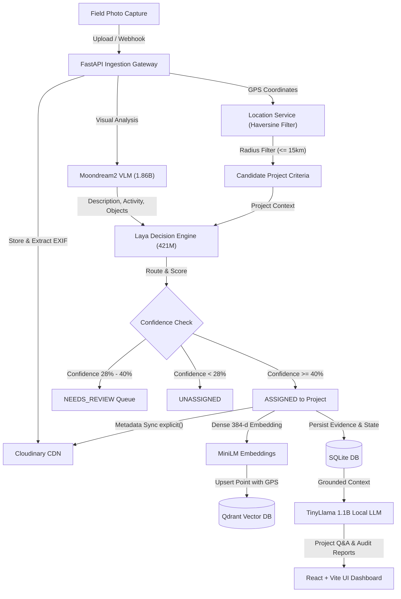

# MIRA — Multimodal Intelligent Retrieval & Analysis Architecture
*Code Cubicle 6.0 — PS02: AI-Powered Field Media Intelligence Platform & Cloudinary Track*

---

## 1. System Overview & Core Philosophy

**MIRA** is an enterprise-grade field media intelligence and automated spatial-semantic routing platform. It solves the critical bottleneck faced by infrastructure, environmental, and renewable energy organizations: ingesting thousands of unorganized field photos and converting them into structured, searchable project intelligence.

### Key Innovations:
1. **Cloudinary as the Intelligence Backbone**: Beyond cloud storage, Cloudinary serves as a queryable metadata layer and dynamic transformation engine (real-time provenance watermarks, dual-layer before/after composites, AI smart crops, and Boolean metadata search).
2. **Dual-Stage System 1 Decision Routing**: Combines Haversine spatial radius filtering ($d \le 15\text{ km}$) with a non-autoregressive ModernBERT decision engine (`laya`) executing in $\sim 33\text{ms}$ per forward pass.
3. **100% Offline / Local AI Engine**: Runs local Vision-Language Models (`moondream2`), dense embeddings (`all-MiniLM-L6-v2`), vector indexing (`Qdrant`), and local generative LLMs (`TinyLlama-1.1B-Chat`) without external paid APIs.

---

## 2. End-to-End Media Processing Pipeline



### Detailed Pipeline Stages:

1. **Ingestion & Geotagging**:
   - Accepts media via `POST /media/process` or event-driven `POST /media/webhook`.
   - Extracts EXIF metadata (GPS latitude/longitude, creation timestamps) or accepts manual override coordinates.
2. **Spatial Candidate Pre-Filtering**:
   - `LocationService` calculates Haversine great-circle distances between asset GPS and registered project location coordinates.
   - Restricts routing candidates to projects within a 15 km geographic radius.
3. **Local Vision-Language Analysis (`Moondream2`)**:
   - Analyzes images via a GPU/CPU in-memory singleton.
   - Produces structured JSON: `description`, `activity`, `scene`, `objects`, and `project_signals`.
4. **Fast Non-Autoregressive Routing (`Laya`)**:
   - Evaluates visual context against candidate project descriptions simultaneously.
   - Assigns probability scores with calibrated certainty thresholds:
     - $\ge 40\%$: Automatic assignment (`ASSIGNED`).
     - $28\% - 40\%$: Human-in-the-loop review queue (`NEEDS_REVIEW`).
     - $< 28\%$: Tagged as `UNASSIGNED`.
5. **Cloudinary Metadata Synchronization (`explicit()`)**:
   - Writes visual descriptions, activities, GPS coordinates, and routing scores back to Cloudinary asset `context` and `tags`.
   - Ensures the CDN repository remains a self-describing, searchable intelligence archive.
6. **Vector Embedding & Qdrant Indexing**:
   - Constructs unified semantic documents and embeds them into 384-dimensional vectors using `all-MiniLM-L6-v2`.
   - Indexes vectors into Qdrant alongside project IDs and GPS payloads for sub-millisecond retrieval.

---

## 3. Cloudinary Media Intelligence Layer

```
┌─────────────────────────────────────────────────────────────┐
│                    Cloudinary Architecture                  │
├──────────────────────────────┬──────────────────────────────┤
│ Computational Layer          │ Delivery & Transformation    │
├──────────────────────────────┼──────────────────────────────┤
│ • explicit() Metadata Sync   │ • Verified Badge (l_text)    │
│ • Search API Boolean Queries │ • Split Composite Comparison │
│ • Upload Presets & Webhooks  │ • Multi-Aspect Social Crops  │
│ • Signed Ingestion (HMAC)    │ • f_auto, q_auto Adaptive    │
└──────────────────────────────┴──────────────────────────────┘
```

### Dynamic Transformation Capabilities:
* **Verified Impact Watermark (`get_verified_badge_url`)**:
  `https://res.cloudinary.com/.../l_text:Arial_22_bold:MIRA%20VERIFIED%20IMPACT/fl_layer_apply,g_north_east/l_text:Arial_16_bold:GPS%2028.61N%2077.20E/.../image.jpg`
* **Side-by-Side Before/After Composite (`get_before_after_composite_url`)**:
  `https://res.cloudinary.com/.../c_fill,w_1200,h_600/l_{after_id}/c_fill,w_600,h_600/fl_layer_apply,g_east/l_text:Arial_20_bold:BEFORE/.../image.jpg`
* **Smart Cropping & Campaign Aspect Exporter (`get_campaign_aspect_urls`)**:
  Generates 1:1 Square (`w_1080,h_1080`), 16:9 Landscape (`w_1920,h_1080`), and 9:16 Vertical Story (`w_1080,h_1920`) with AI focal point tracking (`g_auto, c_fill`).

---

## 4. Local Project Intelligence & Grounded AI Chat (RAG)

```
User Query (Project Scoped)
       │
       ▼
Intent Classifier (GREETING, REPORT, CHANGE, STATUS, RECENT_ACTIVITY, TIMELINE, EVIDENCE_SEARCH, GENERAL)
       │
       ├───────────────────────────────────────────┐
       ▼                                           ▼
Specialized Directive Handler              Qdrant Semantic Search
(SSIM Diff, Report Builder, Status)      (Project-Filtered Embeddings)
       │                                           │
       └─────────────────────┬─────────────────────┘
                             │
                             ▼
                 RAG Grounding Prompt Builder
                             │
                             ▼
               TinyLlama-1.1B-Chat (CUDA FP16)
                             │
                             ▼
               Structured Intelligence Response
                 + Matching Visual Photo Cards
```

* **Model**: `TinyLlama/TinyLlama-1.1B-Chat-v1.0` loaded locally in half-precision (`torch.float16`) on CUDA.
* **Strict Project Isolation**: Context injection filters out cross-project visual logs.
* **Negative Query Handling**: Explicitly verifies site operations before answering; refrains from hallucinating non-existent community or physical activities.

---

## 5. Database Schema & Data Models

### Relational Schema (SQLite / PostgreSQL Compatible)

```sql
-- Project Workspaces
CREATE TABLE projects (
    id TEXT PRIMARY KEY,
    name TEXT NOT NULL,
    description TEXT,
    location_name TEXT,
    latitude FLOAT,
    longitude FLOAT,
    created_at TIMESTAMP DEFAULT CURRENT_TIMESTAMP
);

-- Media Assets
CREATE TABLE media_assets (
    id TEXT PRIMARY KEY,
    file_name TEXT,
    file_path TEXT,
    cloudinary_url TEXT,
    cloudinary_public_id TEXT,
    original_public_id TEXT,
    file_size INTEGER,
    mime_type TEXT,
    image_latitude FLOAT,
    image_longitude FLOAT,
    location_source TEXT, -- 'EXIF' or 'MANUAL'
    project_id TEXT REFERENCES projects(id),
    assignment_status TEXT, -- 'assigned', 'needs_review', 'unassigned'
    processing_status TEXT, -- 'QUEUED', 'ANALYZING', 'ROUTING', 'INDEXING', 'READY', 'FAILED'
    cloudinary_metadata_synced BOOLEAN DEFAULT FALSE,
    created_at TIMESTAMP DEFAULT CURRENT_TIMESTAMP
);

-- Visual Evidence Extracted by VLM
CREATE TABLE visual_evidence (
    id TEXT PRIMARY KEY,
    project_id TEXT REFERENCES projects(id),
    asset_id TEXT REFERENCES media_assets(id),
    activity TEXT,
    scene TEXT,
    objects TEXT, -- JSON Array
    description TEXT,
    project_signals TEXT, -- JSON Array
    routing_confidence FLOAT,
    location TEXT,
    timestamp TEXT,
    created_at TIMESTAMP DEFAULT CURRENT_TIMESTAMP
);

-- Project Scoped Chat Conversations
CREATE TABLE chat_messages (
    id TEXT PRIMARY KEY,
    project_id TEXT REFERENCES projects(id),
    role TEXT NOT NULL, -- 'user' or 'assistant'
    message TEXT NOT NULL,
    intent TEXT,
    evidence TEXT, -- JSON Array of attached evidence items
    created_at TIMESTAMP DEFAULT CURRENT_TIMESTAMP
);

-- Structural Progression Comparison Pairs
CREATE TABLE comparison_pairs (
    id TEXT PRIMARY KEY,
    project_id TEXT REFERENCES projects(id),
    before_asset_id TEXT REFERENCES media_assets(id),
    after_asset_id TEXT REFERENCES media_assets(id),
    change_score FLOAT,
    composite_url TEXT,
    summary TEXT,
    created_at TIMESTAMP DEFAULT CURRENT_TIMESTAMP
);
```

---

## 6. Frontend State Machine (React + Vite)

* **Asynchronous Polling Engine (`useMediaLibrary`)**: Dynamically polls backend endpoints at 3-second intervals during active processing transitions (`QUEUED` $\rightarrow$ `ANALYZING` $\rightarrow$ `ROUTING` $\rightarrow$ `INDEXING`), automatically sleeping when all media assets achieve `READY` status.
* **Component Architecture**:
  * `ProjectDetail`: Tabbed workspace featuring **Interactive Progression Slider**, **AI Project Intelligence Chat**, **Evidence Gallery**, **Milestone Timeline**, and **Audit Report Generator**.
  * `MediaLibrary`: Visual upload manager with drag-and-drop ingestion and real-time processing indicator.
  * `Search`: Dual-mode semantic and Cloudinary expression search interface with filter drawer.
  * `NeedsReview`: Triage queue for manual assignment of low-confidence media assets.
